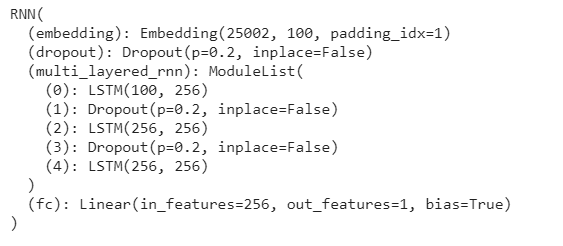

# Week 4 - PyTorch

This assignment is based on the Week4 class and gives some practise on PyTorch

## Group Members
Anubhab Panda (pandaanubhav@gmail.com)
Sachin Dangayach (sachin.dangayach@gmail.com)
Sairam Subramaniam (sairam.subramaniam@gmail.com)

## Assignment Instructions

Use [this](https://github.com/bentrevett/pytorch-sentiment-analysis/blob/master/2%20-%20Upgraded%20Sentiment%20Analysis.ipynb) as a reference and Change this code in such a way that:

1. It has 3 LSTM layers
2. It has used a **for loop** to do so in the forward function
3. The dropout value used is 0.2
4. Trained on the text that is reversed (for example "my name is Rohan" becomes "Rohan is name my"
5. Achieves 87% or more accuracy

## Model Summary

The model has **3,393,385** trainable parameters

## Hyperparameters

* Batch Size: 64
* Epochs: 20
* Loss Function: BCE with logit loss
* Optimizer: Adam
* LR: 0.01
* Hidden Size: 256
* Embedding Dimension: 100
* Dropout: 0.2

**Solution can be found [here](https://nbviewer.jupyter.org/github/anubhabPanda/END_Phase1/blob/main/Week4/S4_Assignment_Solution.ipynb)**