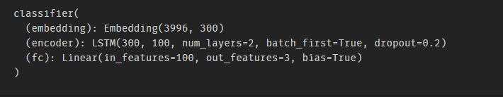

# Week 7 - Hands On

This assignment is based on the Week7 class and gives some practise on Sentiment Analysis using LSTMs

## Assignment Instructions

1. Look at [this](https://colab.research.google.com/drive/19wZi7P0Tzq9ZxeMz5EDmzfWFBLFWe6kN?usp=sharing) code. It has additional details on "Back Translate", i.e. using Google translate to convert the sentences. It has "random_swap" function, as well as "random_delete".
2. Use "Back Translate", "random_swap" and "random_delete" to augment the data you are training on
3. Download the StanfordSentimentAnalysis Dataset from this [link](http://nlp.stanford.edu/~socherr/stanfordSentimentTreebank.zip).
4. Use "datasetSentences.txt" and "sentiment_labels.txt" files from the zip you just downloaded as your dataset. This dataset contains just over 10,000 pieces of Stanford data from HTML files of Rotten Tomatoes. The sentiments are rated between 1 and 25, where one is the most negative and 25 is the most positive.
5. Train your model and try and achieve 60%+ accuracy. Upload your colab file on git with the the training logs

## Model Summary

The model has **1,440,703** trainable parameters

## Hyperparameters

* Batch Size: 32
* Epochs: 10
* Loss Function: Cross Entropy Loss
* Optimizer: Adam
* LR: 0.0001
* Hidden Size: 100
* Embedding Dimension: 300
* Dropout: 0.2

Final Test Accuracy of the model is **77.23%**

**Solution can be found [here](https://github.com/anubhabPanda/END_Phase1/blob/main/Week7/S7_Assignment_Solution.ipynb)**